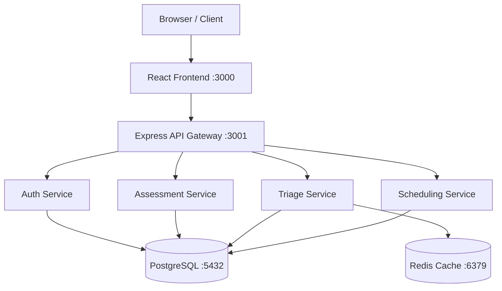
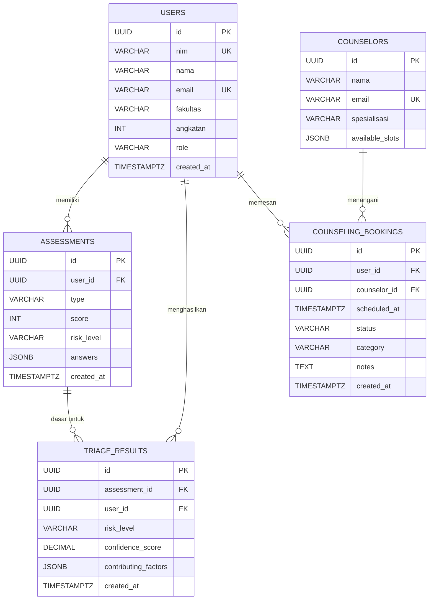

<div align="center">

# SIGAP UB

**Sistem Informasi Asesmen dan Pemantauan Psikologis**

*Mengoptimalkan kapasitas 5 konselor untuk menjangkau 75.000 mahasiswa*

[](https://github.com/arvamadax/sigap-ub)
[](https://ub.ac.id)


</div>

<br/>

## 1. Tentang Solusi

Layanan psikologi Universitas Brawijaya saat ini menghadapi **bottleneck struktural**:
rasio konselor sekitar **1 : 15.000** terhadap populasi mahasiswa, dengan
waktu tunggu pemesanan sesi konseling rata-rata mencapai **±4 bulan**.
Akibatnya, mahasiswa yang membutuhkan intervensi cepat sering tidak
terjangkau, dan beban administratif konselor menghambat fokus klinis.

**SIGAP UB hadir sebagai *capacity multiplier*** — bukan menggantikan konselor,
melainkan **mengoptimalkan kapasitas 5 konselor agar mampu menjangkau
± 75.000 mahasiswa** melalui:

1. **Triase mandiri 5-menit** dengan tiga instrumen klinis tervalidasi:
   **PHQ-9** (Depresi), **GAD-7** (Kecemasan), dan **SRQ-20** (Skrining Umum).
2. **Klasifikasi berbasis skor klinis tervalidasi WHO** — sistem
   menggunakan *threshold cut-off* deterministik, **bukan machine learning**.
   Setiap output dapat diaudit ulang oleh tim psikolog.
3. **Pemesanan konseling prioritas** — slot pertama dialokasikan untuk
   mahasiswa kategori Tinggi/Kritis sehingga konselor fokus pada kasus
   yang paling membutuhkan.

> **Catatan transparansi:** SIGAP UB tidak menggunakan AI generatif maupun
> model machine learning. Semua keputusan triase mengikuti aturan skor
> klinis yang diterbitkan oleh komunitas riset internasional dan WHO.

### Fitur Utama

| Fitur | Deskripsi |
|-------|-----------|
| **Triase Mandiri** | Skrining 5 menit dengan PHQ-9, GAD-7, dan SRQ-20 |
| **Klasifikasi Deterministik** | Threshold cut-off klinis tervalidasi WHO, bukan ML |
| **Dashboard Mahasiswa** | Riwayat asesmen, rekomendasi, dan profil risiko personal |
| **Dashboard Konselor** | Triase real-time, distribusi risiko, dan notifikasi prioritas |
| **Dual-Mode Login** | Autentikasi terpisah untuk mahasiswa (SSO SIAM) dan konselor |
| **Pemesanan Konseling** | Slot prioritas untuk kategori Tinggi/Kritis |
| **WCAG AA Accessible** | Keyboard navigable, contrast ratio 4.6:1, focus indicators |

---

## 2. Arsitektur Sistem



### Tabel Komponen

| Service | Port | Teknologi | Fungsi |
|---|---|---|---|
| Frontend | 3000 | React 19 + Vite | UI mahasiswa & konselor |
| API Gateway | 3001 | Node.js + Express | Routing & autentikasi |
| Auth Service | - | JWT + OAuth 2.0 sim. | Login SSO UB |
| Assessment Service | - | Express Router | Simpan & hitung skor |
| Triage Service | - | Express + logika skor | Klasifikasi risiko klinis |
| Scheduling Service | - | Express Router | Pemesanan konseling |
| Database | 5432 | PostgreSQL 15 | Penyimpanan utama |
| Cache | 6379 | Redis 7 | Session & rate limit |

Detail tambahan, termasuk sequence diagram submit asesmen, ada di
[`docs/architecture.md`](docs/architecture.md).
Spesifikasi API lengkap tersedia di [`docs/api-spec.yaml`](docs/api-spec.yaml).

---

## 3. ERD / Skema Database



DDL lengkap + indeks + seed contoh ada di [`docs/erd.sql`](docs/erd.sql).

---

## 4. Setup & Menjalankan Lokal (Docker)

```bash
# 1. Clone repo
git clone https://github.com/arvamadax/sigap-ub.git
cd sigap-ub

# 2. Salin environment variables
cp .env.example .env

# 3. Jalankan semua service
docker-compose up --build

# Akses aplikasi:
# Frontend  → http://localhost:3000
# Backend   → http://localhost:3001
# API Docs  → http://localhost:3001/api-docs
```

### Tanpa Docker

```bash
# Frontend
npm install
npm run dev

# Backend (terminal terpisah)
cd backend
npm install
npm run dev
```

### Kredensial Demo

| Email / NIM | Password | Peran |
|-------------|----------|-------|
| `arva@student.ub.ac.id` atau `255150300111053` | `SIGAP-UB123` | Mahasiswa |
| `fristian@student.ub.ac.id` atau `25515030111106` | `SIGAP-UB123` | Mahasiswa |
| `farrel@student.ub.ac.id` atau `255150301111027` | `SIGAP-UB123` | Mahasiswa |
| `konselor@ub.ac.id` | `SIGAP-UB123` | Konselor |

---

## 5. Logika Klasifikasi Risiko

### Cut-off Skor PHQ-9 (Depresi)
| Skor | Interpretasi | Risk Level |
|---|---|---|
| 0–4 | Minimal | Rendah |
| 5–9 | Ringan | Rendah |
| 10–14 | Sedang | Sedang |
| 15–19 | Sedang-Berat | Tinggi |
| 20–27 | Berat | Kritis |

### Cut-off Skor GAD-7 (Kecemasan)
| Skor | Interpretasi | Risk Level |
|---|---|---|
| 0–4 | Minimal | Rendah |
| 5–9 | Ringan | Rendah |
| 10–14 | Sedang | Sedang |
| 15–21 | Berat | Tinggi |

### Cut-off Skor SRQ-20 (Skrining Umum)
| Skor | Interpretasi | Risk Level |
|---|---|---|
| 0–5 | Sehat | Rendah |
| 6–7 | Ringan | Rendah |
| 8–12 | Sedang | Sedang |
| 13+ | Berat | Tinggi |

**Logika kombinasi:** ambil **level tertinggi** dari ketiga instrumen
(urutan: Rendah < Sedang < Tinggi < Kritis).

```text
function classifyRisk(phq9Score, gad7Score, srq20Score):
  levels = [getPhq9Level(phq9Score),
            getGad7Level(gad7Score),
            getSrq20Level(srq20Score)]
  finalLevel = max(levels) berdasarkan urutan: Rendah < Sedang < Tinggi < Kritis
  factors = instrumen yang berkontribusi ke level tertinggi
  return { level: finalLevel, factors: factors }
```

> **Catatan:** Sistem ini menggunakan klasifikasi berbasis threshold skor
> klinis tervalidasi WHO — bukan model machine learning generatif.

Pembahasan lengkap (3 skenario kasus, flowchart, referensi ilmiah) ada di
[`notebooks/triage_logic.md`](notebooks/triage_logic.md).

---

## 6. Tech Stack

| Komponen | Teknologi | Versi | Justifikasi |
|---|---|---|---|
| Frontend | React + TypeScript + Vite | 19 / 5.8 / 6.2 | Ekosistem mature, TypeScript safety |
| Styling | Tailwind CSS | v4 | Utility-first, konsisten |
| Backend | Node.js + Express | 20 / 4.x | Event-driven, cocok real-time notif |
| Database | PostgreSQL | 15 | ACID compliant, JSONB untuk data asesmen |
| Cache | Redis | 7 | Session management & rate limiting |
| Container | Docker + Compose | latest | Reproducible environment |
| Auth | JWT + OAuth 2.0 sim. | - | Kompatibel arsitektur SSO UB |
| API Docs | Swagger / OpenAPI | 3.0 | Dokumentasi interaktif |

---

## 7. Struktur Direktori

```
sigap-ub/
├── README.md                          ← dokumen ini
├── docker-compose.yml                 ← orkestrasi semua service
├── Dockerfile                         ← multi-stage frontend
├── nginx.conf                         ← konfigurasi SPA nginx
├── .env.example                       ← template environment variables
├── index.html                         ← entry HTML frontend
├── package.json                       ← dependency frontend
├── vite.config.ts
├── tsconfig.json
├── docs/
│   ├── architecture.md                ← arsitektur + sequence diagram
│   ├── api-spec.yaml                  ← OpenAPI 3.0 spec
│   └── erd.sql                        ← DDL + seed PostgreSQL
├── src/                               ← frontend React
│   ├── App.tsx                        ← root component + routing + login modal
│   ├── main.tsx
│   ├── index.css
│   ├── types.ts
│   ├── services/
│   │   ├── auth.ts                    ← autentikasi + akun demo
│   │   └── storage.ts                 ← localStorage persistence layer
│   ├── data/
│   │   ├── assessments.ts             ← soal kuesioner PHQ-9, GAD-7, SRQ-20
│   │   └── mockData.ts               ← data mock triase konselor
│   └── components/
│       ├── LandingView.tsx            ← halaman utama + hero cards
│       ├── DashboardView.tsx          ← dashboard mahasiswa
│       ├── AssessmentView.tsx         ← halaman pengisian kuesioner
│       ├── KonselorView.tsx           ← dashboard konselor / triase
│       ├── Icons.tsx
│       ├── Toast.tsx
│       ├── ConfirmModal.tsx
│       ├── dashboard/                 ← sub-komponen dashboard mahasiswa
│       │   ├── SummaryBar.tsx
│       │   ├── RecommendationCard.tsx
│       │   ├── AssessmentGrid.tsx
│       │   ├── ProfileCard.tsx
│       │   ├── HistoryCard.tsx
│       │   └── CounselingCard.tsx
│       └── konselor/                  ← sub-komponen dashboard konselor
│           ├── KonselorSummaryBar.tsx
│           ├── TriaseTable.tsx
│           ├── RisikoChart.tsx
│           └── NotifikasiTriase.tsx
├── backend/
│   ├── Dockerfile
│   ├── package.json
│   └── src/
│       ├── app.js                     ← Express entry point
│       ├── middleware/
│       │   └── auth.js                ← JWT verification
│       ├── routes/
│       │   ├── auth.js
│       │   ├── assessments.js
│       │   ├── triage.js
│       │   └── counseling.js
│       └── db/
│           └── schema.sql
└── notebooks/
    └── triage_logic.md                ← penjelasan algoritma triase
```

---

## 8. Tim Pengembang

| Nama | NIM | Role |
|---|---|---|
| Arva Mada Jayastu | 255150300111053 | Ketua Tim / Lead Developer |
| Farrel Arzaqia Mecca | 255150301111027 | Backend Developer |
| Fristian Boas Nathaniel | 25515030111106 | Front End Developer |

**Fakultas Ilmu Komputer, Universitas Brawijaya — 2026**

---

<div align="center">

---

**SIGAP UB** — Dikembangkan untuk TEKRA 2026 Software Development Challenge

Tema: *Smart Campus* · Fokus: *Kesehatan Mental Mahasiswa*

Fakultas Ilmu Komputer, Universitas Brawijaya

</div>
