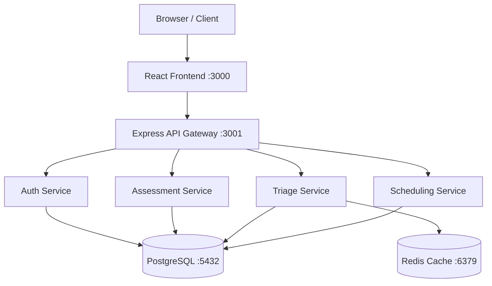

# SIGAP UB — TEKRA 2026 Software Development Challenge
# Claude Code Prompt: Build Complete Repository

## KONTEKS

Proyek: SIGAP UB (Sistem Informasi Asesmen dan Pemantauan Psikologis)  
Kompetisi: TEKRA 2026 — Software Development Challenge, Universitas Brawijaya  
Tim: Arva Mada Jayastu, Farrel Arzaqia Mecca, Fristian Boas Nathaniel  
Tema Lomba: Smart Campus  
Frontend existing: React 19 + TypeScript + Vite + Tailwind CSS v4 (sudah ada di /src)

Repo ini dinilai berdasarkan:
- Relevansi Masalah (15%)
- Analisis Kebutuhan & Desain (20%)
- Logika Solusi & Problem Solving (20%)
- **Implementasi & Repositori GitHub (20%) ← ini yang kita bangun**
- Presentasi & QnA (25%)

Tujuan prompt ini: membangun seluruh struktur repo yang lengkap, runnable,
dan memenuhi checklist wajib TEKRA 2026 (Guide Book hal. 17).

---

## STRUKTUR REPO TARGET

Buat file/folder berikut dari root repository:

```
sigap-ub/
├── README.md                          ← WAJIB, lengkap sesuai checklist TEKRA
├── docker-compose.yml                 ← WAJIB, menjalankan seluruh sistem lokal
├── Dockerfile                         ← untuk frontend React (multi-stage)
├── .env.example                       ← template environment variables
├── docs/
│   ├── architecture.md               ← diagram arsitektur mermaid
│   ├── api-spec.yaml                  ← OpenAPI 3.0 spec semua endpoint
│   └── erd.sql                        ← DDL SQL lengkap (CREATE TABLE)
├── src/                               ← frontend React existing (JANGAN DIUBAH)
├── backend/
│   ├── Dockerfile
│   ├── package.json
│   └── src/
│       ├── app.js                     ← Express server entry point
│       ├── routes/
│       │   ├── auth.js
│       │   ├── assessments.js
│       │   ├── triage.js
│       │   └── counseling.js
│       ├── middleware/
│       │   └── auth.js                ← JWT verification middleware
│       └── db/
│           └── schema.sql
└── notebooks/
    └── triage_logic.md                ← penjelasan logika klasifikasi risiko
```

---

## TASK 1 — README.md

Buat `README.md` di root dengan seksi-seksi berikut. Isi setiap seksi dengan
konten yang akurat sesuai sistem SIGAP UB.

### 1. Tentang Solusi

Jelaskan:
- Masalah rasio konselor 1:15.000 di UB, waktu tunggu 4 bulan
- Pendekatan SIGAP UB sebagai *capacity multiplier* — bukan menggantikan konselor,
  melainkan mengoptimalkan kapasitas 5 konselor agar menjangkau 75.000 mahasiswa
- Tiga instrumen klinis tervalidasi WHO: PHQ-9 (depresi), GAD-7 (kecemasan), SRQ-20 (skrining umum)
- **Penting:** gunakan frasa "klasifikasi berbasis skor klinis tervalidasi",
  BUKAN "AI" atau "kecerdasan buatan" — sistem ini menggunakan threshold skor, bukan ML

### 2. Arsitektur Sistem

Buat diagram Mermaid berikut:



Sertakan tabel komponen:

| Service | Port | Teknologi | Fungsi |
|---|---|---|---|
| Frontend | 3000 | React 19 + Vite | UI mahasiswa & konselor |
| API Gateway | 3001 | Node.js + Express | Routing & autentikasi |
| Auth Service | - | JWT + OAuth 2.0 sim. | Login SSO UB |
| Assessment Service | - | Express Router | Simpan & hitung skor |
| Triage Service | - | Express + logika skor | Klasifikasi risiko klinis |
| Scheduling Service | - | Express Router | Pemesanan konseling |
| Database | 5432 | PostgreSQL 15 | Penyimpanan utama |
| Cache | 6379 | Redis 7 | Session & rate limit |

### 3. ERD / Skema Database

Buat diagram Mermaid `erDiagram` untuk tabel-tabel berikut:

- `users` (id, nim, nama, email, fakultas, angkatan, role, created_at)
- `assessments` (id, user_id FK, type, score, risk_level, answers JSONB, created_at)
- `triage_results` (id, assessment_id FK, user_id FK, risk_level, confidence_score, contributing_factors JSONB, created_at)
- `counseling_bookings` (id, user_id FK, counselor_id FK, scheduled_at, status, category, notes, created_at)
- `counselors` (id, nama, email, spesialisasi, available_slots JSONB)

### 4. Setup & Menjalankan Lokal (Docker)

Instruksi step-by-step:

```bash
# 1. Clone repo
git clone https://github.com/[username]/sigap-ub.git
cd sigap-ub

# 2. Salin environment variables
cp .env.example .env

# 3. Jalankan semua service
docker-compose up --build

# Akses aplikasi:
# Frontend  → http://localhost:3000
# Backend   → http://localhost:3001
# API Docs  → http://localhost:3001/api-docs
```

Sertakan juga cara menjalankan **tanpa Docker**:

```bash
# Frontend
npm install
npm run dev

# Backend (terminal terpisah)
cd backend
npm install
npm run dev
```

### 5. Logika Klasifikasi Risiko (Notebook Section)

Buat subseksi "Logika Triase Klinis" yang menjelaskan:

**Cut-off skor PHQ-9:**
| Skor | Interpretasi | Risk Level |
|---|---|---|
| 0–4 | Minimal | Rendah |
| 5–9 | Ringan | Rendah |
| 10–14 | Sedang | Sedang |
| 15–19 | Sedang-Berat | Tinggi |
| 20–27 | Berat | Kritis |

**Cut-off skor GAD-7:**
| Skor | Interpretasi | Risk Level |
|---|---|---|
| 0–4 | Minimal | Rendah |
| 5–9 | Ringan | Rendah |
| 10–14 | Sedang | Sedang |
| 15–21 | Berat | Tinggi |

**Cut-off skor SRQ-20:**
| Skor | Interpretasi | Risk Level |
|---|---|---|
| 0–5 | Sehat | Rendah |
| 6–7 | Ringan | Rendah |
| 8–12 | Sedang | Sedang |
| 13+ | Berat | Tinggi |

**Logika kombinasi:** ambil level tertinggi dari ketiga instrumen.

Pseudocode fungsi `classifyRisk(phq9, gad7, srq20)`:

```
function classifyRisk(phq9Score, gad7Score, srq20Score):
  levels = [getPhq9Level(phq9Score), getGad7Level(gad7Score), getSrq20Level(srq20Score)]
  finalLevel = max(levels) berdasarkan urutan: Rendah < Sedang < Tinggi < Kritis
  factors = instrumen yang berkontribusi ke level tertinggi
  return { level: finalLevel, factors: factors }
```

> Catatan: Sistem ini menggunakan klasifikasi berbasis threshold skor klinis
> tervalidasi WHO — bukan model machine learning generatif.

### 6. Tech Stack

| Komponen | Teknologi | Versi | Justifikasi |
|---|---|---|---|
| Frontend | React + TypeScript + Vite | 19 / 5.8 / 6.2 | Ekosistem mature, TypeScript safety |
| Styling | Tailwind CSS | v4 | Utility-first, konsisten |
| Backend | Node.js + Express | 20 / 4.x | Event-driven, cocok real-time notif |
| Database | PostgreSQL | 15 | ACID compliant, JSONB untuk data asesmen |
| Cache | Redis | 7 | Session management & rate limiting |
| Container | Docker + Compose | latest | Reproducible environment |
| Auth | JWT + OAuth 2.0 sim. | - | Kompatibel arsitektur SSO UB |
| API Docs | Swagger / OpenAPI | 3.0 | Dokumentasi interaktif |

### 7. Struktur Direktori

Tampilkan tree direktori lengkap sesuai struktur di atas.

### 8. Tim Pengembang

| Nama | NIM | Role |
|---|---|---|
| Arva Mada Jayastu | 255150300111053 | Ketua Tim / Frontend Developer |
| Farrel Arzaqia Mecca | 255150301111027 | Backend Developer |
| Fristian Boas Nathaniel | 25515030111106 | Desain & Dokumentasi |

Fakultas Ilmu Komputer, Universitas Brawijaya — 2026

---

## TASK 2 — docs/erd.sql

Buat file SQL DDL lengkap dengan `CREATE TABLE` untuk semua tabel berikut.

Ketentuan:
- Tambahkan `PRIMARY KEY`, `FOREIGN KEY` yang tepat
- Buat `INDEX` pada kolom: `user_id`, `created_at`, `risk_level`
- Gunakan `ENUM` atau `CHECK CONSTRAINT` untuk `risk_level` dan tipe asesmen
- Tambahkan komentar SQL (`--`) per tabel menjelaskan fungsinya
- Sertakan seed data minimal di akhir file:
  - 2 user dummy (mahasiswa)
  - 1 counselor dummy
  - 1 contoh assessment record

Tabel yang harus dibuat:
- `users` (id UUID PK, nim VARCHAR UNIQUE, nama, email UNIQUE, fakultas, angkatan INT, role CHECK IN ('mahasiswa','konselor','admin'), created_at TIMESTAMPTZ DEFAULT NOW())
- `assessments` (id UUID PK, user_id UUID FK → users, type CHECK IN ('gad7','phq9','srq20'), score INT, risk_level CHECK IN ('rendah','sedang','tinggi','kritis'), answers JSONB, created_at TIMESTAMPTZ DEFAULT NOW())
- `triage_results` (id UUID PK, assessment_id UUID FK → assessments, user_id UUID FK → users, risk_level, confidence_score DECIMAL(4,2), contributing_factors JSONB, created_at TIMESTAMPTZ DEFAULT NOW())
- `counseling_bookings` (id UUID PK, user_id UUID FK → users, counselor_id UUID FK → counselors, scheduled_at TIMESTAMPTZ, status CHECK IN ('pending','confirmed','completed','cancelled'), category VARCHAR, notes TEXT, created_at TIMESTAMPTZ DEFAULT NOW())
- `counselors` (id UUID PK, nama VARCHAR, email VARCHAR UNIQUE, spesialisasi VARCHAR, available_slots JSONB)

---

## TASK 3 — docker-compose.yml

Buat `docker-compose.yml` yang menjalankan:

- `frontend`: build dari `Dockerfile` di root, port `3000:80`
- `backend`: build dari `backend/Dockerfile`, port `3001:3001`, depends_on db + redis
- `db`: image `postgres:15-alpine`, port `5432:5432`, volume untuk persistensi data, healthcheck dengan `pg_isready`
- `redis`: image `redis:7-alpine`, port `6379:6379`, healthcheck dengan `redis-cli ping`

Semua environment variables dibaca dari file `.env`.
`backend` harus `depends_on` db dan redis dengan kondisi `service_healthy`.

---

## TASK 4 — Dockerfile (root, untuk frontend)

Buat multi-stage Dockerfile:
- **Stage 1 (builder):** `node:20-alpine`, jalankan `npm ci`, `npm run build`
- **Stage 2 (server):** `nginx:alpine`, copy hasil `dist/` dari stage 1, expose port 80

Sertakan file `nginx.conf` minimal untuk SPA routing:
```nginx
location / {
    try_files $uri $uri/ /index.html;
}
```

---

## TASK 5 — backend/src/app.js dan semua routes

Buat Express API dengan ketentuan berikut.

**Setup app.js:**
- Gunakan `express`, `cors`, `helmet`, `morgan` untuk middleware
- Setup Swagger UI di route `/api-docs` menggunakan `swagger-jsdoc` + `swagger-ui-express`
- Semua route di-prefix `/api`
- Tambahkan endpoint `GET /api/health` yang return `{ status: 'ok', timestamp: Date.now() }`

**Semua endpoint return JSON mock** — tidak butuh koneksi DB nyata untuk demo berjalan.
Gunakan in-memory array sebagai penyimpanan sementara.

**Endpoint yang harus dibuat:**

`routes/auth.js`:
- `POST /api/auth/login` → terima `{ nim, password }`, return `{ token, user: { nim, nama, fakultas, role } }`
- `GET /api/auth/verify` → verifikasi JWT dari header `Authorization: Bearer <token>`, return user data

`routes/assessments.js`:
- `POST /api/assessments/submit` → terima `{ type: 'gad7'|'phq9'|'srq20', answers: number[] }`, hitung `score = sum(answers)`, klasifikasikan berdasarkan cut-off yang sama dengan README Task 1, return `{ assessmentId, type, score, riskLevel, interpretation, createdAt }`
- `GET /api/assessments/history` → return array riwayat asesmen user (mock 2–3 item)

`routes/triage.js`:
- `POST /api/triage/classify` → terima `{ phq9Score, gad7Score, srq20Score }`, jalankan logika `classifyRisk()` dari README, return `{ riskLevel, confidenceScore, contributingFactors[] }`

`routes/counseling.js`:
- `POST /api/counseling/book` → terima `{ date, time, category, notes }`, return `{ bookingId, status: 'pending', scheduledAt }`
- `GET /api/counseling/slots` → return array slot tersedia `[{ date, time, available }]`

**Error handling:**
- Semua route punya `try/catch`
- Return `{ error: 'pesan error' }` dengan status code yang tepat (400, 401, 404, 500)

**middleware/auth.js:**
- Middleware JWT verify yang dipakai di semua route kecuali `/auth/login` dan `/health`
- Jika token tidak valid: return 401 `{ error: 'Token tidak valid atau kadaluarsa' }`

---

## TASK 6 — notebooks/triage_logic.md

Buat file markdown yang berfungsi sebagai notebook penjelasan sistem:

1. **Judul:** Logika Klasifikasi Risiko Klinis SIGAP UB
2. **Latar Belakang:** Jelaskan mengapa PHQ-9, GAD-7, dan SRQ-20 dipilih (validasi internasional, adaptasi Indonesia, direkomendasikan WHO)
3. **Tabel Cut-off Skor:** Sama dengan yang di README (tiga tabel terpisah per instrumen)
4. **Algoritma Klasifikasi:** Pseudocode + flowchart Mermaid yang menggambarkan alur keputusan
5. **Contoh Kasus (3 skenario):**
   - Skenario 1: PHQ-9=3, GAD-7=2, SRQ-20=4 → Rendah
   - Skenario 2: PHQ-9=11, GAD-7=8, SRQ-20=9 → Sedang
   - Skenario 3: PHQ-9=18, GAD-7=16, SRQ-20=14 → Kritis
   Tunjukkan step-by-step kalkulasi untuk tiap skenario.
6. **Limitasi Sistem:** "Sistem ini adalah alat bantu skrining awal, bukan pengganti diagnosis klinis oleh psikolog berlisensi. Hasil skrining tidak boleh dijadikan dasar tunggal untuk keputusan klinis."
7. **Referensi:**
   - Spitzer, R.L. et al. (2006). A brief measure for assessing generalized anxiety disorder. *Archives of Internal Medicine*, 166(10), 1092–1097. [GAD-7]
   - Kroenke, K. et al. (2001). The PHQ-9: validity of a brief depression severity measure. *Journal of General Internal Medicine*, 16(9), 606–613. [PHQ-9]
   - World Health Organization. (1994). A user's guide to the Self Reporting Questionnaire (SRQ). Geneva: WHO. [SRQ-20]

---

## TASK 7 — .env.example

Buat file `.env.example` dengan isi:

```
# Database
POSTGRES_DB=sigap_ub
POSTGRES_USER=sigap_user
POSTGRES_PASSWORD=sigap_password
DATABASE_URL=postgresql://sigap_user:sigap_password@db:5432/sigap_ub

# Redis
REDIS_URL=redis://redis:6379

# JWT
JWT_SECRET=ganti-dengan-secret-key-minimum-32-karakter
JWT_EXPIRES_IN=7d

# App
NODE_ENV=development
PORT=3001
FRONTEND_URL=http://localhost:3000
```

---

## TASK 8 — backend/package.json

Buat `package.json` untuk backend dengan dependencies:
- `express`, `cors`, `helmet`, `morgan` — middleware
- `jsonwebtoken` — JWT auth
- `dotenv` — environment variables
- `swagger-jsdoc`, `swagger-ui-express` — API docs
- `uuid` — generate UUID untuk mock data

devDependencies:
- `nodemon` — auto-reload saat development

Scripts:
- `start`: `node src/app.js`
- `dev`: `nodemon src/app.js`

---

## VERIFIKASI AKHIR

Setelah semua task selesai, jalankan perintah berikut dan pastikan tidak ada error:

```bash
# 1. Validasi syntax docker-compose
docker-compose config --quiet

# 2. Validasi TypeScript frontend tidak ada error
npx tsc --noEmit

# 3. Test backend bisa start
cd backend && node src/app.js &
curl http://localhost:3001/api/health
```

---

## CONSTRAINTS

- **Jangan ubah apapun di dalam folder `/src`** (frontend existing)
- Backend harus bisa jalan dengan `npm start` bahkan tanpa database (gunakan mock data in-memory)
- Semua komentar kode dalam **Bahasa Indonesia**
- Nama variabel dan fungsi dalam **Bahasa Inggris** (camelCase)
- README harus valid di GitHub: gunakan Mermaid yang didukung GitHub, bukan format lain
- Jangan install package di luar yang sudah disebutkan di Task 8
- `docker-compose config --quiet` harus pass tanpa error
- `tsc --noEmit` di root harus pass tanpa error
