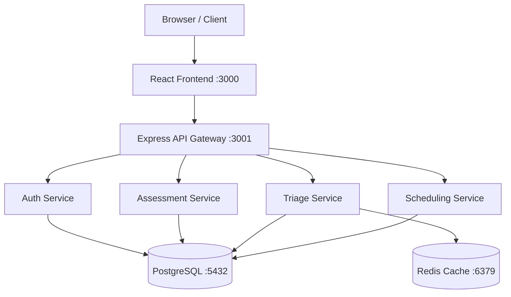
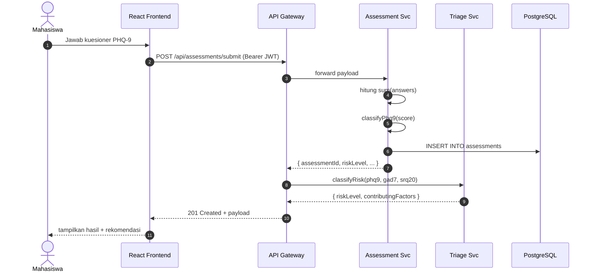

# Arsitektur Sistem SIGAP UB

Dokumen ini menyajikan ringkasan arsitektur teknis SIGAP UB
(Sistem Informasi Asesmen dan Pemantauan Psikologis) untuk
TEKRA 2026 — Software Development Challenge.

## Diagram Layer Tinggi

## Tabel Komponen

| Service | Port | Teknologi | Fungsi |
|---|---|---|---|
| Frontend | 3000 | React 19 + Vite | UI mahasiswa & konselor |
| API Gateway | 3001 | Node.js + Express | Routing & autentikasi |
| Auth Service | - | JWT + OAuth 2.0 sim. | Login SSO UB |
| Assessment Service | - | Express Router | Simpan & hitung skor |
| Triage Service | - | Express + logika skor | Klasifikasi risiko klinis |
| Scheduling Service | - | Express Router | Pemesanan konseling |
| Database | 5432 | PostgreSQL 15 | Penyimpanan utama |
| Cache | 6379 | Redis 7 | Session & rate limit |

## Sequence — Submit Asesmen

## Catatan Desain

- **Stateless API Gateway** — semua otentikasi melalui JWT bearer.
  Redis dipakai untuk rate-limit (mitigasi spam asesmen).
- **JSONB untuk jawaban kuesioner** — memungkinkan penambahan
  instrumen baru tanpa migrasi tabel.
- **Klasifikasi risiko bersifat deterministik** (threshold cut-off
  klinis tervalidasi WHO) — bukan model machine learning, sehingga
  dapat diaudit ulang dan transparan bagi tim psikolog.
- **Pemisahan Service Logic** — masing-masing domain (auth,
  assessment, triage, scheduling) memiliki router Express terpisah
  agar mudah di-extract menjadi microservice di masa mendatang.

## Alur Demo

Alur demonstrasi fitur utama SIGAP UB:

| Langkah | Halaman | Fitur yang Ditampilkan |
|---------|---------|----------------------|
| 1 | Landing Page | Hero section 3 instrumen klinis, badge WHO |
| 2 | Login Mahasiswa | SSO simulasi (`arva@student.ub.ac.id` / `SIGAP-UB123`) |
| 3 | Dashboard Mahasiswa | Profil, rekomendasi asesmen, riwayat kosong (fresh account) |
| 4 | Asesmen PHQ-9 | UI kuesioner accessible, 9 pertanyaan, hasil klasifikasi |
| 5 | Login Konselor | Tab terpisah (`konselor@ub.ac.id` / `SIGAP-UB123`) |
| 6 | Dashboard Konselor | Triase mahasiswa, distribusi risiko, notifikasi |
| 7 | API Docs | Swagger UI di `localhost:3001/api-docs` |

Pada produksi, login terintegrasi dengan SSO SIAM Universitas Brawijaya.

## Color Palette & Brand Tokens

Token warna yang konsisten dipakai di seluruh aplikasi:

| Token | Hex | Penggunaan |
|---|---|---|
| primary-teal | `#0D9488` | CTA, highlight, badge utama |
| dark-teal | `#006565` | Hover state, accent depth |
| bg-cream | `#FDFBF7` | Background utama, soft surface |
| border-light | `#F0EBE2` | Border subtle, divider |
| navy | `#081b3a` | Header modal, footer |
| text-dark | `#1E293B` | Body text utama |
| rose-600 | `#E11D48` | Error state, urgent alert |

Pemilihan warna mengikuti prinsip *calming aesthetic* untuk konteks
kesehatan mental — palette dominan hijau-teal dan krem yang
terbukti menurunkan kecemasan visual saat user berinteraksi dengan
form sensitif.
