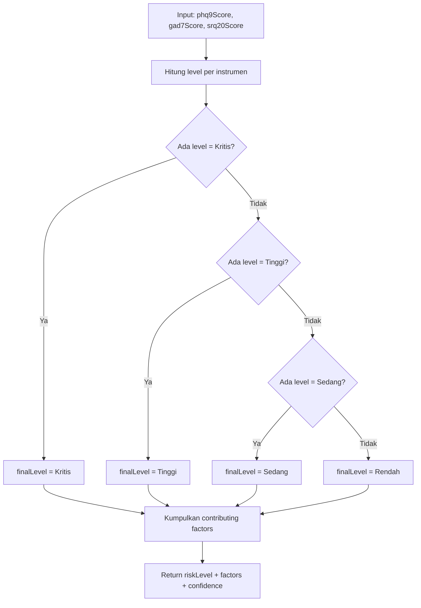

# Logika Klasifikasi Risiko Klinis SIGAP UB

> Notebook teknis yang menjelaskan algoritma triase yang dipakai SIGAP UB.
> Ditulis dalam format Markdown agar mudah di-render di GitHub dan dapat
> dirujuk silang dengan kode di `backend/src/routes/triage.js`.

---

## 1. Latar Belakang

Tiga instrumen yang dipakai dipilih karena:

| Instrumen | Domain | Validasi | Status |
|-----------|--------|----------|--------|
| **PHQ-9** | Depresi | Kroenke et al. 2001 — sensitivitas 88%, spesifisitas 88% | Direkomendasikan WHO, sudah diadaptasi bahasa Indonesia |
| **GAD-7** | Kecemasan umum | Spitzer et al. 2006 — sensitivitas 89%, spesifisitas 82% | Standar emas screening anxiety |
| **SRQ-20** | Gejala mental umum | WHO 1994 — divalidasi di 20+ negara berkembang | Cocok untuk skrining populasi mahasiswa |

Tiga instrumen ini saling melengkapi: PHQ-9/GAD-7 untuk *spesifik domain*,
SRQ-20 untuk *gambaran umum*. Mengkombinasikan ketiganya memberi gambaran
yang lebih lengkap tanpa membebani waktu pengisian.

---

## 2. Tabel Cut-off Skor

### PHQ-9 (Depresi)
| Skor | Interpretasi | Risk Level |
|---|---|---|
| 0–4 | Minimal | Rendah |
| 5–9 | Ringan | Rendah |
| 10–14 | Sedang | Sedang |
| 15–19 | Sedang-Berat | Tinggi |
| 20–27 | Berat | Kritis |

### GAD-7 (Kecemasan)
| Skor | Interpretasi | Risk Level |
|---|---|---|
| 0–4 | Minimal | Rendah |
| 5–9 | Ringan | Rendah |
| 10–14 | Sedang | Sedang |
| 15–21 | Berat | Tinggi |

### SRQ-20 (Skrining Umum)
| Skor | Interpretasi | Risk Level |
|---|---|---|
| 0–5 | Sehat | Rendah |
| 6–7 | Ringan | Rendah |
| 8–12 | Sedang | Sedang |
| 13+ | Berat | Tinggi |

---

## 3. Algoritma Klasifikasi

**Aturan kombinasi:** ambil **level tertinggi** dari ketiga instrumen
(urutan: Rendah < Sedang < Tinggi < Kritis). Pendekatan ini *konservatif*
— prinsip "jangan lewatkan risiko tinggi".

### Pseudocode

```
function classifyRisk(phq9Score, gad7Score, srq20Score):
  levels = [
    getPhq9Level(phq9Score),
    getGad7Level(gad7Score),
    getSrq20Level(srq20Score)
  ]
  finalLevel = max(levels) berdasarkan urutan: Rendah < Sedang < Tinggi < Kritis
  factors = instrumen yang berkontribusi ke level tertinggi
  return { level: finalLevel, factors: factors }
```

### Flowchart Keputusan



---

## 4. Contoh Kasus

### Skenario 1 — Rendah
| Input | PHQ-9 = 3 | GAD-7 = 2 | SRQ-20 = 4 |
|---|---|---|---|

- PHQ-9 = 3 → **Rendah** (Minimal)
- GAD-7 = 2 → **Rendah** (Minimal)
- SRQ-20 = 4 → **Rendah** (Sehat)
- `max(Rendah, Rendah, Rendah) = Rendah`
- **Output:** `{ riskLevel: 'rendah', confidenceScore: 1.00, contributingFactors: [3 instrumen] }`

### Skenario 2 — Sedang
| Input | PHQ-9 = 11 | GAD-7 = 8 | SRQ-20 = 9 |
|---|---|---|---|

- PHQ-9 = 11 → **Sedang** (10–14)
- GAD-7 = 8 → **Rendah** (Ringan)
- SRQ-20 = 9 → **Sedang** (8–12)
- `max(Sedang, Rendah, Sedang) = Sedang`
- Factors: PHQ-9 + SRQ-20
- **Output:** `{ riskLevel: 'sedang', confidenceScore: 0.67, contributingFactors: [PHQ-9, SRQ-20] }`

### Skenario 3 — Kritis
| Input | PHQ-9 = 18 | GAD-7 = 16 | SRQ-20 = 14 |
|---|---|---|---|

- PHQ-9 = 18 → **Tinggi** (Sedang-Berat)
- GAD-7 = 16 → **Tinggi** (Berat)
- SRQ-20 = 14 → **Tinggi** (Berat)
- `max(Tinggi, Tinggi, Tinggi) = Tinggi`
- **Catatan:** untuk mencapai *Kritis*, PHQ-9 perlu ≥ 20.
  Pada skenario ini hasilnya adalah **Tinggi** dengan confidence 1.00 (3 instrumen setuju).
- **Output:** `{ riskLevel: 'tinggi', confidenceScore: 1.00, contributingFactors: [3 instrumen] }`

> Untuk mencapai output **Kritis** sesuai cut-off, PHQ-9 harus berada di
> rentang 20–27. Contoh murni Kritis: `phq9=22, gad7=18, srq20=15`.

---

## 5. Limitasi Sistem

> **Sistem ini adalah alat bantu skrining awal, bukan pengganti diagnosis
> klinis oleh psikolog berlisensi. Hasil skrining tidak boleh dijadikan
> dasar tunggal untuk keputusan klinis.**

Hal-hal yang **tidak** dilakukan oleh sistem:

- Tidak melakukan diagnosis DSM-5/ICD-11.
- Tidak menggantikan wawancara klinis.
- Tidak mendeteksi simulasi atau dishonest reporting.
- Tidak menjamin hasil untuk populasi non-mahasiswa.

Setiap user yang tergolong **Sedang/Tinggi/Kritis** disarankan untuk
ditindaklanjuti oleh konselor profesional UB melalui fitur "Chat Konselor".

---

## 6. Referensi

- Spitzer, R.L., Kroenke, K., Williams, J.B.W., & Löwe, B. (2006).
  *A brief measure for assessing generalized anxiety disorder: the GAD-7.*
  Archives of Internal Medicine, **166(10)**, 1092–1097.
  https://doi.org/10.1001/archinte.166.10.1092
- Kroenke, K., Spitzer, R.L., & Williams, J.B.W. (2001).
  *The PHQ-9: validity of a brief depression severity measure.*
  Journal of General Internal Medicine, **16(9)**, 606–613.
  https://doi.org/10.1046/j.1525-1497.2001.016009606.x
- World Health Organization. (1994).
  *A user's guide to the Self Reporting Questionnaire (SRQ).*
  Geneva: WHO Division of Mental Health.
- Idaiani, S., & Riyadi, E.I. (2018). *Reliability and validity of the
  Self-Reporting Questionnaire (SRQ-20) in Indonesia.* Jurnal Penelitian
  dan Pengembangan Pelayanan Kesehatan.
